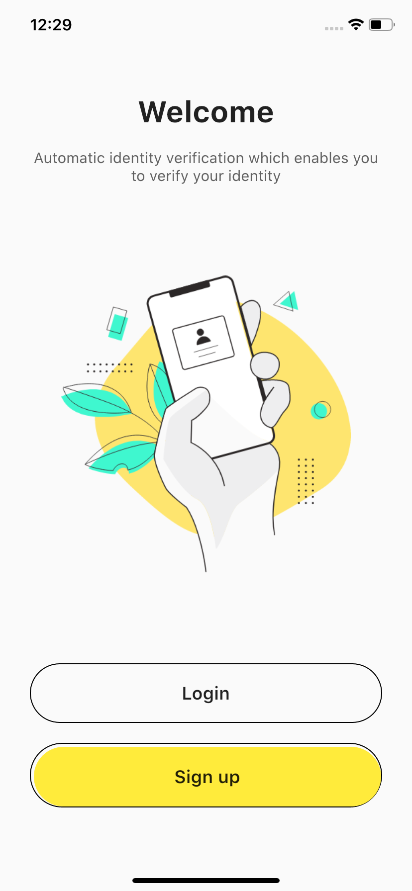

Flutter Login & Sign Up UI

A modern and responsive login/sign-up flow built with Flutter. This beginner-friendly project helps practice form validation, navigation, and clean UI design in Flutter apps.

---

📱 Features

Welcome Screen with illustration and navigation buttons

Login Page with email & password fields

Sign Up Page with email, password, and confirm password fields

Styled buttons with rounded design

Simple and minimal UI for practice

Fully responsive layout

---

📸 Screenshots

  
  
  

---

📌 Notes

This project is created for learning and practice purposes.

Focuses on UI layout, form fields, and navigation between screens.

This project is based on a YouTube tutorial and was built for learning purposes.

All code is written manually for better understanding.

---

🧑‍💻 Author

Sameer Asghar
GitHub Profile
